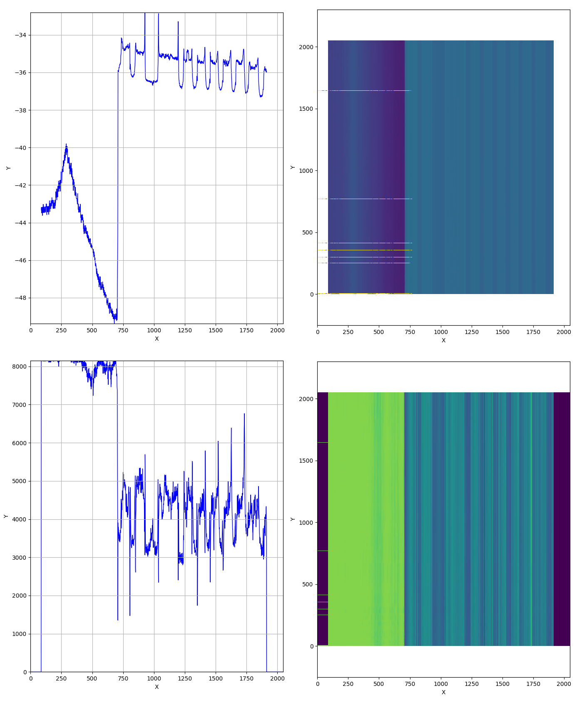

Access VRMagic sensor through Aravis in Python
===============================================

Aravis must be built with GObject introspection enabled `./configure --enable-introspection=yes`, this makes the Python wrapper automatically accessible.

These scripts work around [this issue](https://github.com/AravisProject/aravis/issues/147) when reporting coordinate transformation parameters.

* `single-frame.py` is a simple acquisition and transformation test for a single frame, plotting the resulting profile as uninterpreted int16 data (first plot) and point coordinates (second plot)

[!Single frame: raw](fig/vrmagic-frame-raw.png)

[!Single frame: coordinates](fig/vrmagic-frame-depth.png)

* `continuous-save-hdf5.py` receives frames from the sensor continuously (in a different thread) and saves them in a chunked manner to HDF5 (for later processing). There are some glitches in the output, which might be related to bfufer handling (yellow lines), as shown in this plot; vertical axis is time, horizontal is FOV; upper plots is the depth coordinate (typical profile and time map), lower plots are intensity values (typical profile and time map) of a static scene.

